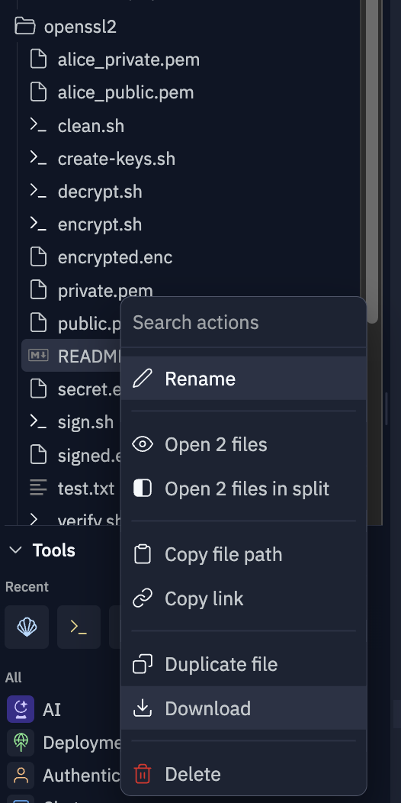
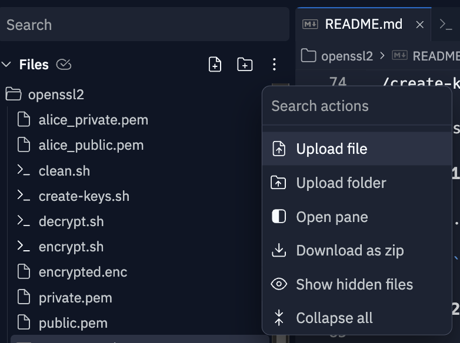

# Encrypt and decrypt using asymmetric pulic and private keys with openssl and pkeyutl
- [credit to gwpl for providing openssl examples using pkeyutl](https://gist.github.com/gwpl/2c7636f0b200cbfbe82cc9d4f6338585)

## Create Keys
To create the a default private/public key pair in PEM format with the names `private.pem` and `public.pem` use the `create-keys.sh` script
```
./create-keys.sh
```
To create a named private/public key pair in the PEM format, provide a name as an argument to the `create-keys.sh` script
```
./create-keys.sh <name>
```
For example, to create public and private keys for `alice`, named `alice_private.pem` and `alice_public.pem`, do the following:
```
./create-keys.sh alice
```
## Encrypting ##
To encrypt the default file named `test.txt` with the default public key, use the `encrypt.sh` script.  The `encrypt.sh` reads a text file and writes the encrypted output to a file namded `encrypted.enc`
```
./encrypt.sh
```
To encrypt a file named `secret.txt` with the default public key
```
./encrypt.sh secret.txt
```
To use the `encrypte.sh` script with a specific public key, first export the key in the shell.  Here is an example that encrypts the `secret.txt` file using the `alice_public.pem`:
```
export PUBLIC_KEY=alice_public.pem
./encrypt.sh secret.txt
```
## Decrypting ##

To decrypt with the default private key, use the `decrypt.sh` script.  The `decrypt.sh` script reads the `encrypted.enc` file and writes to the file `decrypted.txt`.  It also compares the decrypted.txt to the original `test.txt` if no argument provided.  The `decrypt.sh` will take an additional argument to specify a compare file (if different from text.txt)
```
./decrypt.sh [compare_file]
```
For example, to decrypt a file and compare it to `secret.txt` do the following
```
./decrypt.sh secret.txt
```
To specify the private key to use for decryption, first export the `PRIVATE_KEY` in the shell before running decrypt. The following example uses alice's private key to decrypt and compares it to secret.txt
```
export PRIVATE_KEY=alice_private.pem
./decrypt.sh secret.txt
```

## cryptographic signing ##
**Cryptographically signing** a file provides two main benefits:

**Authentication**: The signature verifies the sender's identity. Only the holder of the private key can create a valid signature, so the recipient can be sure of the sender's identity.

**Integrity**: The signature ensures the file has not been tampered with during transmission. Any changes to the file after it was signed will cause the signature verification to fail.

To generate a file with signature using private key use the `sign.sh` script.  A singned file named `signed.enc` will be produced.  By default the `sign.sh` will verify the `test.txt` file.  To specify a different file, provide the filename as an argument to `sign.sh`
```
./sign.sh [file-to-sign]
```
To specify the private key to use for signing, first export the `PRIVATE_KEY` environment variable before running the `sign.sh`.  The following example uses the `alice_private.pem` private key to sign the `needs-signature.txt` file
```
export PRIVATE_KEY=alice_private.pem
./sign.sh needs-signature.txt
```


## verifying a cryptographic signature ##
To verify the `signed.enc` file with the default public key, use the `./verify.sh` script.  The `verify.sh` script will use the `test.txt` file by default to compare. To specify another file to verify, provide it as an agument to the `verify.sh` script
```
./verify.sh [file-to-verify]
```
To specify the public key to use for verifying the `signed.enc` file, first export the `PUBLIC_KEY` environment variable before running he `verify.sh` script.  The following example uses the `alice_public.pem` public key to verify the `file-to-verify.txt` file
```
export PUBLIC_KEY=alice_public.pem
./verify.sh file-to-verify.txt
```

# Encrypt and Decrypt with public and private keys
## step 0 create a key pair ##
*Hint use a simple password when prompted, as it will need to be typed each time the private key is used*
```
./create-keys.sh
```
Two keys should be created `private.pem` and `public.pem`

## step 1 encrypt the test.txt file using the public key ##
```
./encrypt.sh
```
The file `encrypted.enc` will be created

## step 2 decrypt and verify the encrypted file ##
```
./decrypt.sh
```

# Group Exercise: Encrypt and Decrypt with friends
## step 0 create a keypair using your name
*Hint use a simple password when prompted, as it will need to be typed each time the private key is used*

*substitute `<your-name>` with your own name :-)*
```
./create-keys.sh <your-name>
```
This will create a named pair of keys in the format `<your-name>_private.pem` and `<your-name>_public.pem`
## step 1 share your key with a friend ##
Download and attach your public key to an email message and mail it to your friend
*Hint: Download your key by right-clicking on the public key file and select download*

attach it to an email addressed to your friend

## step 2 upload a friend's key into replit using the upload widget
Download the attached key from the email and save it to disk.  Use the uplaod file wiget to upload it to replit
*The file will likely go into the base of the project. use the Files tree to move it to the openssl2 directory*


## step 3 encrypt a message using your friend's public key ##
1. Edit the test.txt with a personal message
2. encrypt the file using `encrypt.sh`
   
*hint: substitute `<name>` for the actual name on the key*
```
export PUBLIC_KEY=<name>_public.pem
./encrypt.sh
```
this should produce a file named `encrypted.enc`
## step 4 download the encrypted.enc file and email it ##
As in step 1, mail the encrypted.enc file to your friend

## step 5 save and upload the encrypted.enc file mailed to you
As in step 2, save the encrypted.enc file attached to the email, and upload it to replit.  Move it to the openssl2 directory 

## step 6 decrypt the message using your private key
```
export PRIVATE_KEY=<your-name>_privvate.pem
./decrypt.sh
```
The decrypted text file should appear in a new `decrypted.txt` file